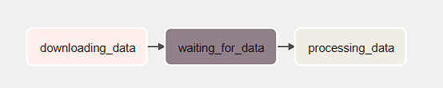
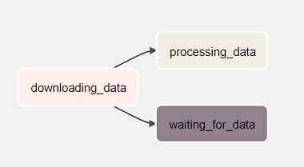
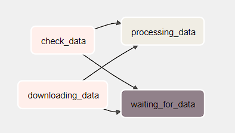
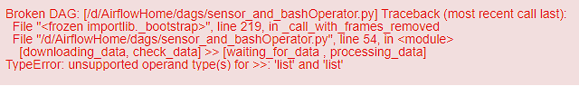

## Dependências

Quando você cria uma DAG com várias tasks, mas não informa a ordem em que as tasks devem ser executadas, ela é exibida da seguinte forma na interface:

Para resolver isso, existem algumas formas de especificar a ordem de execução das tasks.

1. Métodos set_upstream ou set_downstream
Não é muito utilizado:

        task1.set_downstream(task2)
        task2.set_downstream(task3)

    ou

        task3.set_upstream(task2)
        task2.set_upstream(task1)

2. Símbolos >> ou <<
É a forma mais usual

        task1 >> task2 >> task3

Para processar mais de uma tarefa ao mesmo tempo, deve-se usar as listas:

### Chain

Se adicionar a biblioteca *chain*, é possível realizar as chamadas sem usar a funções ou métodos acima.

        from airflow.models.baseoperator import chain

substituir a chamada (task1 >> task2 >> task3) por

        chain(downloading_data, waiting_for_data , processing_data)

### cross_downstream

É útil quando você tem uma dependência cruzada entre as tarefas.
Por exemplo:
task1 e task2 rodam inicialmente mas, para que a tasks3 e task4 sejam executadas, as duas devem terminar antes, ou seja, a task 3 depende do término da task1 e task2, assim como a task4, que também depende da task1 e da task2.

Para isso, deve-se usar o método da seguinte forma:

        cross_downstream([task1, task2], [task3, task4])

Se tentar rodar da forma abaixo, dará erro, pois não é possível criar dependencia direta entre duas listas:

        [task1, task2] >> [task3, task4]

Referência: Verificar o script [sensor_and_bashOperator.py](./dags/sensor_and_bashOperator.py)