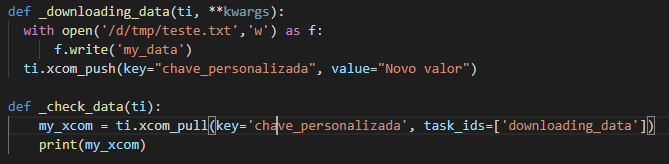

## XCOMS: Compartilhando dados entre tasks

Até o momento, todas as tarefas foram realizadas independentementes, sem que a informação de uma tarefa sirva de entrada para a segunda.

XCOM: *Cross-Communication*

Sempre que uma passagem e dados utilizando XCom é realizada, esses dados são armazenados dentro da base do Airflow, ou seja, eles possuem uma limitação de tamanho, a depender da base utilizada:
  - SQLite: 2GB em um XCom
  - PostgreSQL: 1GB em um XCom
  - MySQL: 64KB em um XCom

Para passar os dados entre as funções, você pode passar o valor usando o *return valor* ou a função xcom_push(valor)

Para receber estes dados, devemos usar as informações de contexto citadas no arquivo [08 - PythonOperator.md](./08%20-%20PythonOperator.md), informando a chave gerada e a lista com as *task_id* vinculadas.

ou

Referência: Script [xcoms.py](./dags/xcoms.py)