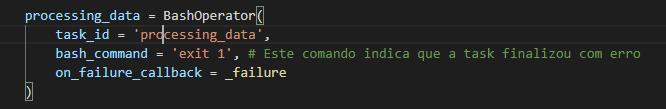
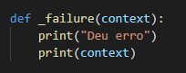
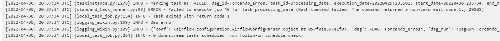

## Erros

Para ver os erros que ocorrem em uma task, deve-se clicar na task com erro - ou marcado para ser realizada uma nova tentativa, se estiver com os parâmetros *retries* e *retry_delay* configurados - e então, clicar em logs, para avaliar o erro e fazer os devidos ajustes.

Para limpar diversas tarefas com erro (supondo no caso de uma execução com backfilling), para não realizar a execuçào individual, deve-se ir em __Browse__ >> __Task Instances__, filtrar pela task, selecionar as tasks desejadas e marcar como *Clear*. Com isso, todas as tasks selecionadas iniciarão automaticamente.

Para comunicar em caso de erro, dentro de *default_args* pode usar os parâmetros *email_on_failure* ou *email_on_retry* como __True__. O parâmetro que informa o e-mail que deve receber as comunicações, chama-se *email*.

Caso queira executar alguma task em caso de erro, deve-se usar o parâmetro *on_failure_callback* na task e informar a função que será executada. Na função, passar como parâmetro o contexto e usar dentro da função conforme necessário.

Ver as chamadas na dag [forcando_erros.py](./dags/forcando_erros.py)