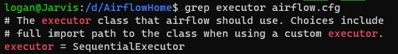
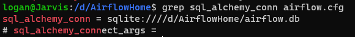

## Executors

Os executors definem como as suas DAGs serão executadas no Airflow.

Todas as tasks disparadas pelo scheduler vão para uma fila... Esta fila é a responsável por enviar ao Executor (ou aos workers) as tarefas e, de acordo com o Executor configurado, um comportamento pode ser realizado.

Por exemplo, se você rodar o Airflow em um cluster Kubernetes, deve-se usar o *Kubernetes Executor*.

O executor instalado por padrão no Airflow é o Sequential Executor, o que faz com que as tasks rodem de forma serializada sempre. Isso é ocorre pois ele é realizado baseado no SQLite, __*que não permite escritas sequenciais*__.

Para verificar qual o executor e a base que estão configurados:

Para escalar o Airflow, um começo é alterar as configurações para utilizar o __Local Executor__ e o __Postgres__.
O Local Executor faz com sub-processos sejam criados a cada chamada, permitindo a execução em paralelo.

## Concorrência

Parâmetros __globais__ que devemos saber quando precisamos utilizar a concorrência entre as tasks:

  - Parallelism:
    - Define o número máximo de tarefas que o Airflow irá executar ao mesmo tempo (__toda a instância do Airflow__).
    - Valor Default: __32__
  - DAG_Concurrency:
    - Define o número de *tarefas de uma DAG* que rodarão em paralelo.
    - Valor Default: __16__
  - MAX_Active_runs_per_DAG:
    - Define o numero de *"DAGRuns"* que podem ser executadas em paralelo para uma determinada DAG.
    - Valor Default: __16__

Para restringir a execução paralela de uma DAG em específico (*DAGRuns*), deve-se utilizar o parâmetro __max_active_runs__.

Para restringir o número de tarefas que podem ser executadas em paralelo para uma determinada DAG, deve-se utilizar o parâmetro __concurrency__ na DAG.

